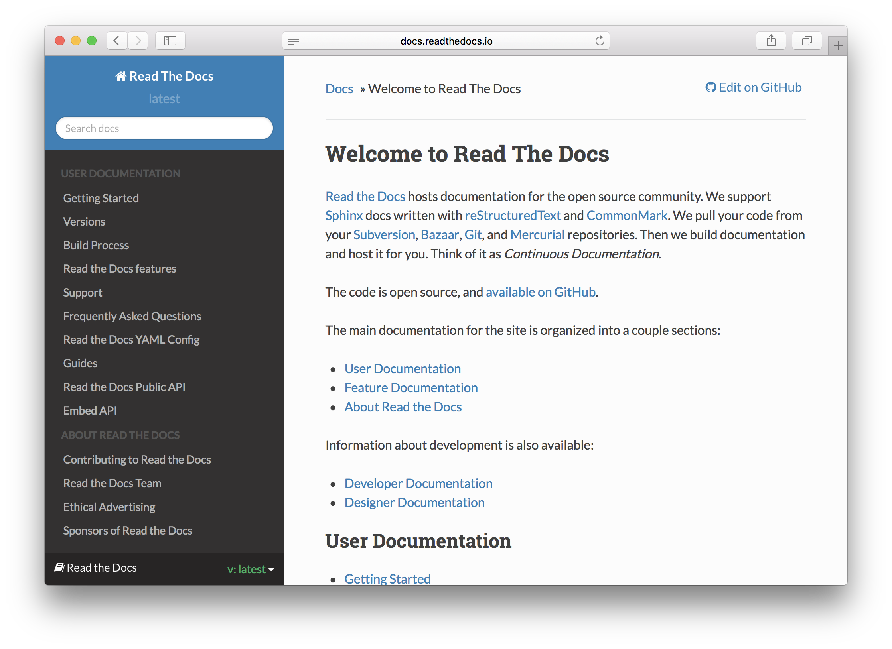

=================================================
Read The Docs Nginx
=================================================




This Docker image will create simple Documentation base on [Sphinx Read The Docs Theme](https://github.com/snide/sphinx_rtd_theme) as you've seen from [ReadTheDocs.org](https://readthedocs.org). You can mount your docs source to this image, or you can pull from your public and/or private github. 


## Mounting Docs
Mount your volume to '/root/docs_source' and it will automatically be generated on startup.
```bash
docker run -it -v /var/mydocs:/root/docs_source -p 80:80 hunterlong/read_the_docs_nginx
```

## Docs From Public Github Repo
'DOCS_FOLDER' should equal the folder inside the repo that holds the documentation (*.rst). You can remove this if the repo is just the documentation. 
```bash
docker run -it -p 80:80 \
  -e "GITHUB_REPO=hunterlong/read_the_docs_nginx" \
  -e "GIT_BRANCH=master" \ 
  -e "DOCS_FOLDER=docs" \ 
  hunterlong/read_the_docs_nginx
```

## Docs From Private Github Repo
You can generate a Personal Token from Github. [https://help.github.com/articles/creating-an-access-token-for-command-line-use/](https://help.github.com/articles/creating-an-access-token-for-command-line-use/)
```bash
docker run -it -p 80:80 \
  -e "GITHUB_REPO=hunterlong/read_the_docs_nginx" \
  -e "GIT_BRANCH=master" \ 
  -e "GIT_USERNAME=mygithubuser" \ 
  -e "GIT_PERSONAL_TOKEN=h7d9ka82ihjd929jd38hfhaiqnc" \ 
  -e "GIT_BRANCH=master" \ 
  -e "DOCS_FOLDER=docs" \ 
  hunterlong/read_the_docs_nginx
```

## Custom Spinx Build Config
Inside the directory of the docs, you should have a file [conf.py](https://github.com/hunterlong/read_the_docs_nginx/blob/master/docs/conf.py). You must include the file included or change file to your own. In this config file, you change docs Name, Version, and more settings.

## Custom Nginx Config
If you'd like to edit the Nginx Config file for hosting the docs, checkout [conf/nginx/webapp.conf](https://github.com/hunterlong/read_the_docs_nginx/blob/master/conf/nginx/app.conf). If your github repo has folder 'conf/nginx' it will look for app.conf. It will be automatically copied from the github repo into Nginx. 

You can also mount your config like so:
```bash
docker run -it -v /var/mydocs:/root/docs_source \
  -v /etc/mynginx/vhost.conf:/etc/nginx/sites-enabled/webapp.conf \
  -p 80:80 hunterlong/read_the_docs_nginx
```
